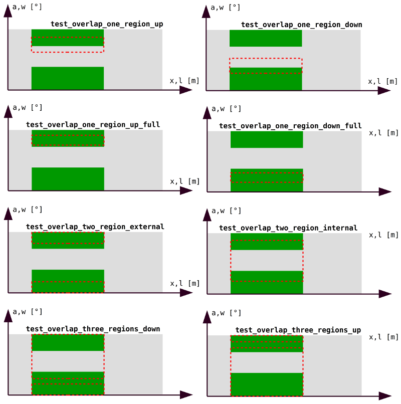
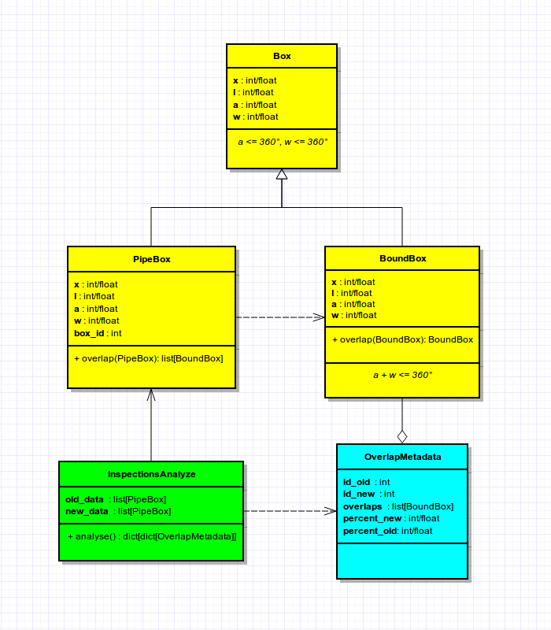

# SET UP

**Python >= 2.7.6**  
**virtualenv >= 1.11.4**  

`git clone https://github.com/zimonc/ndtest.git`  
`cd ndtest`  
`make`  
`make test`  
`source env/bin/activate`  
`make develop` or `make install`  
`ndtest --old <path_to_old_inspection_csv --new <path_to_new_inspection_csv> [--reverse]`

Output is pretty basic and shows as many sections as the number of new boxes and for each section are listed (if any) the overlapped old boxes and the percentages of coverage of both new and old boxes.  
To arrange the output with sections based on old boxes, pass the `--reverse` argument.

# INSPECTION DATA

Inspection data must be given as a csv file tab delimited with the following structure:

| id| x | l | a | w |
|---|---|---|---|---|
| 1 | 20| 50| 30| 60|
| 2 | 20| 50|180| 60|
| 3 | 40| 50|100| 70|

1. The id column is given by uniquely identify a box for a given inspection, thus boxes ids coming from different inspections doesn't necessarily refer to the same area although such an assumption would greatly simplify the problem.
2. While we expect that boxes coming from different inspections (thus from different files) may
contain overlaps of any kind, here we assume that boxes coming from the same inspection
**does not** contain overlaps.
3. Data need to be ordered by increasing values of `x` and for equal values of `x` by increasing values of `a`.  
I actually believe that data coming from a pipeline inspection already have some kind of sorting that could be leveraged; 
for the purposes of this test, rather than placing a requirement to the data ordering, the `loader.load` function sorts it as required.
4. I also assumed the data size small enough to be held and manipulated in memory as I did.

# ALGORITHM

The algorithm model here implemented starts from a `Box` class, who represents a rectangle on a cylindrical surface identified by the following coordinates:

- **x** initial position in the longitudinal axis (meters)
- **l** length (meters)
- **a** initial positions in the circumferential axis (degrees)
- **w** width (degrees) where
- **a/w constraint** a <= 360, w <= 360

The rectangle surfaces coming from pipeline inspections are instead represented by the `PipeBox` class, which has the same properties of the `Box` one
and one property more:

- **box_id** unique identifier of inspection data

The class `PipeBox` has an `overlap` method who takes another `PipeBox` and return the overlap.
That method is complicated in case one or both `PipeBox`es are wrapped around 0°/360°.
However, since a `Box` crossing that line can be broken in two `Box`es
(one with the bottom side at 0° and the other with the top side at 360°)
I approached the problem by introducing the `BoundBox` class, which is simply a `Box` with a new constraint
preventing it to cross 0°/360°:

- **a/w constraint** a + w <= 360

The `BoundBox` class has an `overlap` method greatly simplified, while in turn the `PipeBox` class relies on the representation in `BoundBox`
to implement its own `overlap`.
Notice that while `BoundBox.overlap` returns `None` or a single `BoundBox`,
`PipeBox.overlap` returns a list of `PipeBox` whose number of elements may be from 0 to 3.
The image below explains the geometrical meaning of the unit tests applied to `PipeBox`.



The problem ask to compare boxes coming from an old inspection to boxes coming from a new one and verify if they have the same location in the pipeline; the operation is performed by the `InspectionsAnalyzer`.  
The `analyse` method of `InspectionsAnalyzer` implements the complete algorithm: it checks for overlapping between old boxes and new boxes and returns a data structure that maps an `OverlapMetadata` for each overlapping pairs.  
Below a simplified UML diagram who shows the relation between all the classes involved.



Since I was unable to made some reasonable and credible assumptions aboutdata coming from inspections to simplify the algorithm, I addressed the general case i.e. number and position of each `PipeBox` is completely arbitrary in each set of data.  
Given the nature of the problem, in case of two unordered `list` of `N` and `M` elements the complexity of the algorithm would be **`O(N·M)`**.  
It is plausible to believe that the real data from inspections comes with some kind of sorting,
however `InspectionsAnalyzer.analyse` assumes that boxes are sorted as stated in point 3 of **INSPECTION DATA** section and in such a case its complexity is strictly lower.  
That could also be seen by the implementation of `InspectionsAnalyzer.analyse` method where in the heart of its nested loop
the statement to execute is prompted by `InspectionsAnalyzer._prompt_statement`.  
If the last call always returned `PASS` or `CONTINUE` (or if there was no call at all) the complexity would be exactly **`O(N·M)`** while it decrease more and more along with the number of returned `BREAK`.

To test the `ndtest` script you can also use the `inspection_data_old.csv` and `inspection_data_new.csv` files that are in the `doc` folder.
The `diagram.jpg` in the same folder represents those data in the **`x,a`** plane and helped me to easily think the distributions of boxes to fully stress the algorithm and check the accuracy of the results as well (click on the download button to zoom it).  
As stated in its documentazion, `InspectionsAnalyzer.analysis` returns a dictionary whose keys are box ids of the new inspection while values are dictionaries whose keys are box ids of the old inspection which values are `OverlapMetadata` objects who describe the overlap between pairs **box_id_new -> box_id_old** pointing to them.  
Thus, changing the role of new and old data (i.e. passing the new data as old and vice versa) that dictionary should change as   well, however the set of `OverlapMetadata` they have must be exactely the same; in terms of python that means:

```python
def list_overlaps(data):
    overlaps = []
    for id_external in data:
        for id_internal in data[id_external]:
            overlaps.extend(data[id_external][id_internal].overlaps)
    overlaps.sort(key=operator.attrgetter('x', 'a'))
    return overlaps

analyzer1 = inspection.InspectionsAnalyzer(new_data, old_data)
analyzer2 = inspection.InspectionsAnalyzer(old_data, new_data)
data1 = analyzer1.analyze()
data2 = analyzer2.analyze()
assert list_overlaps(data1) == list_overlaps(data2)
```

Finally, notice that the output got by changing the role of new and old data is the same (except the `New` and `Old` lables)
you get by passing the `reverse` argument to the `ndtest` script.

# NOTES

I would have preferred a solution where `PipeBox` was able to manage alone the case of wrapping around 0°/360°,
but I had to follow that way almost like a workaround because (francly) I was unable to think an easier and cleaner solution in the limited time.
The `InspectionsAnalyzer` class uses one anti-pattern known as **Accumulate and fire**.
I still used it because in the context of this test doesn't exist those problems which the pattern may be subject (action at a distance, unexpected results in multithreading etc ...).

Really cool problem ... and not that simple.
